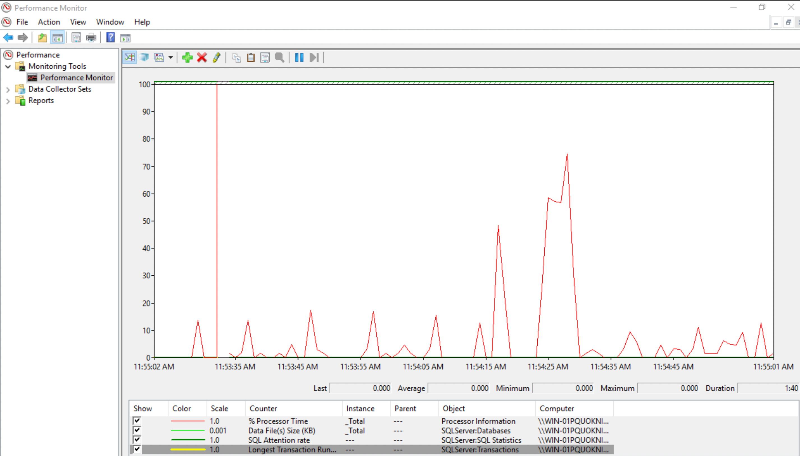
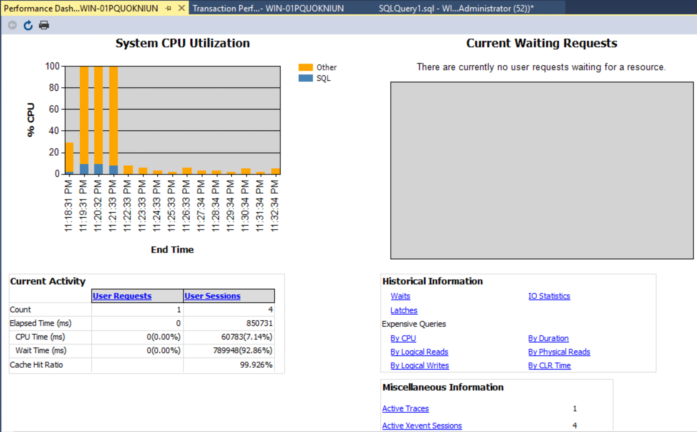
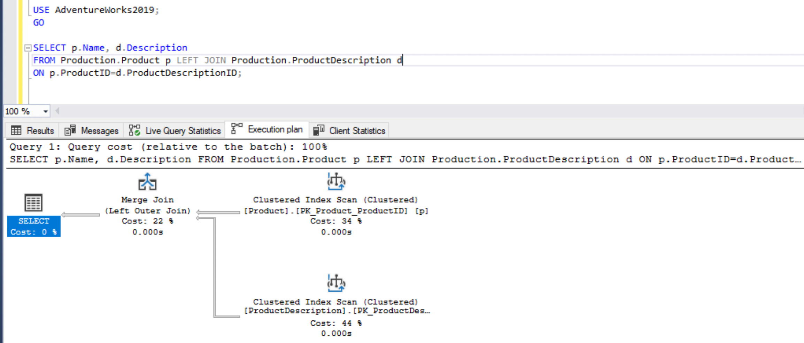
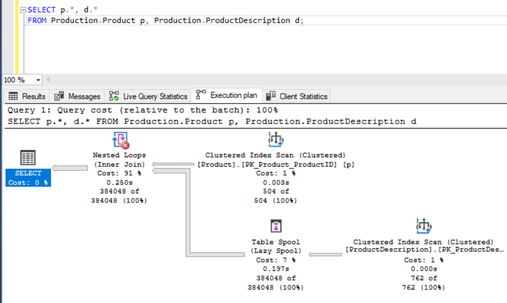
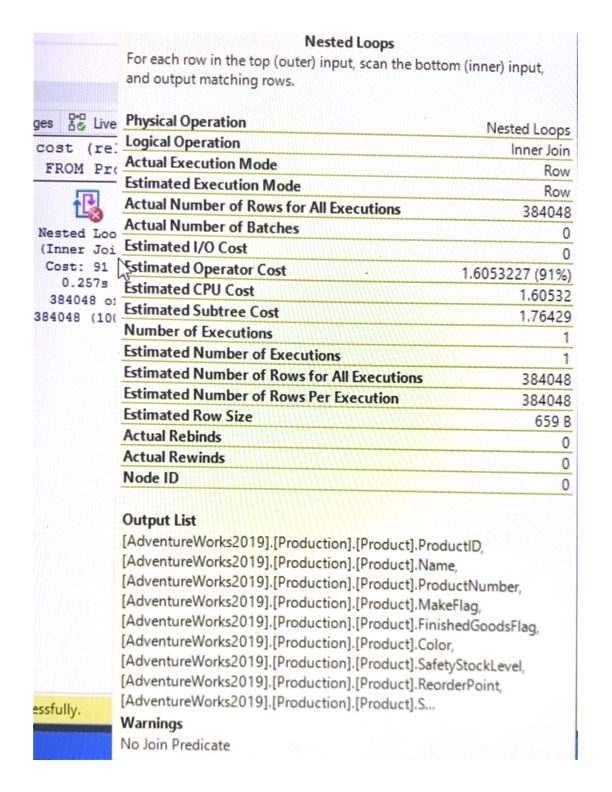

Performance monitoring includes monitoring the MS SQL Server database.
MS SQL Server and the Microsoft Windows OS provide monitoring utilities, that help you to optimize the resources and improve performance.

## System/Performance Monitor

Monitors the utilization of system resources.

Go to **Start > Run**, type `perfmon` and select **OK**.

To add/delete the key parameters, use the Add (green) and Delete (red) keys on the Performance Monitor screen.

## Activity Monitor in SSMS

The Activity Monitor monitors the query execution and displays statistics such as Processes, Resource Waits, Recent and Active Expensive Queries.

Open SSMS, and connect to your server instance.
Select **Activity Monitor** from the top ribbon bar.

## Performance Dashboard in SSMS

The dashboard provides visual insights into the performance of the SQL Server instance.

In the Object Explorer, right-click on the SQL Server instance name and select **Reports > Standard Reports > Performance Dashboard**.

The Performance Dashboard helps to identify **System CPU Utilization, Current Waiting Requests**, and performances measured based on several other metrics.

## Execution Plan - Estimated and Actual

The cost-based query optimizer in SQL Server calculates costs based on multiple possible plans.

Click the **Estimated Execution Plan** and **Actual Executed Plan** button next to the **Execute** button in SSMS.

The actual execution plan includes runtime statistics.
To capture an actual execution plan, the query has to be executed.

In general, you can use the estimated execution plan to monitor the performance of your query.
The actual execution plan is useful to determine the runtime performance of the query.

In the actual execution plan, the Nested Loops component indicates a red cross.

When you hover over each component, you can view additional information.

To optimize this query re-write it as the first query with selected columns and a join clause.

## Query Optimization

Here are some of the SQL query best practices that you can follow for better SQL Server database performance.

* Avoid `SELECT *`: Use specific column names in the select query that you want to view instead of using the wildcard `*` to list all columns.
* Use [`EXISTS`](https://docs.microsoft.com/en-us/sql/t-sql/language-elements/exists-transact-sql?view=sql-server-ver15) instead of `COUNT(*)`. This reduces the number of rows read count drastically.
* Avoid using SQL `DISTINCT` keyword. Instead, use `GROUP BY` or a subquery.
* Avoid a wildcard `%` character in the search string. This will avoid table scans by the query optimizer.
* Use the `WHERE` clause to filter the data first and then use the `HAVING` clause for the aggregate data filter.
