---
title: "Hasura Setup"
metaTitle: "Hasura Authentication Setup | Hasura GraphQL Tutorial"
metaDescription: "Setting up Hasura for authentication"
---

Alright, we're about to begin our foray into authentication with Hasura.

First off, we need to do some set up.

### Config Variables

Since we have deployed Hasura GraphQL Engine on Heroku, let's head to [Heroku dashboard](https://dashboard.heroku.com/apps) to configure the admin secret and JWT secret. 

Open the "Settings" page for your Heroku app, add a new Config Var called HASURA_GRAPHQL_JWT_SECRET, and copy and paste the code below into the value box.

```json
{
  "type": "HS256",
  "key": "JWTSecretMustBeAtLeast32CharactersLong!"
}
```

Replace the key with any key you want but it must be at least 32 characters long.

Next, create a new Config Var called HASURA_GRAPHQL_ADMIN_SECRET and enter a secret key to protect the GraphQL endpoint. (Imagine this as the password to your GraphQL server).

You should end up with something like the following:

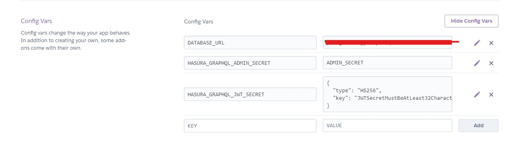

### Permissions and Roles

Next up, go to your Hasura console. Refresh it if it was already open. You'd be asked to pput in your admin secret to log in.

In the `Request Headers` slot in the GraphiQL tab, add key `x-hasura-admin-secret` and set it to your secret. This would enable you to have admin privileges when using GraphiQL

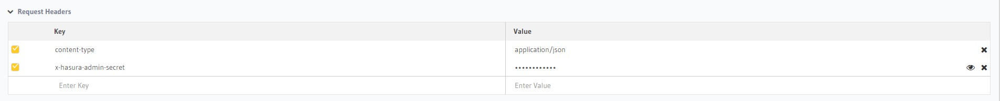

Next up, go to the `Data` tab and click the `users` table.

We shall add another column called 

`password` (String, nullable)

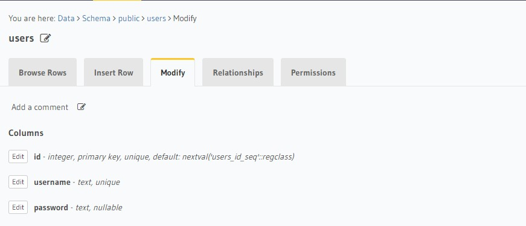

Go to `Insert Row` and add another mock user

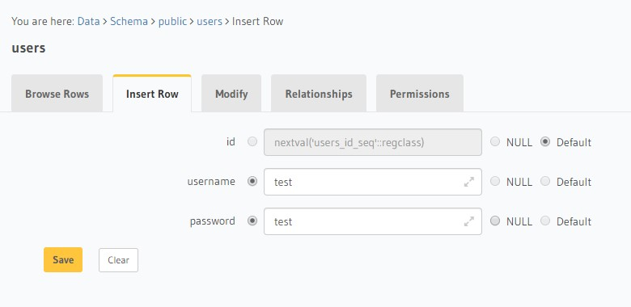

Next, go to the `Permissions` tab and create a new role called `user`

Set Insert, Update, Select, and Delete permissions

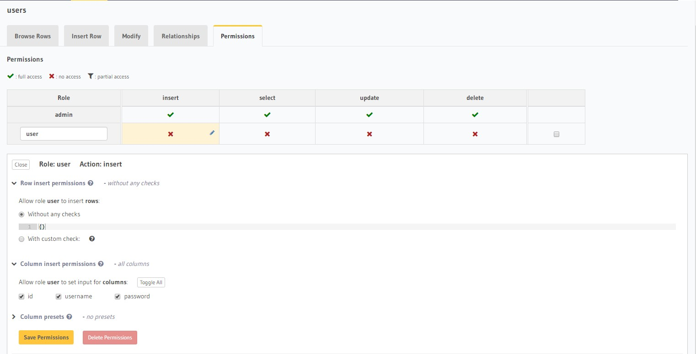
Insert

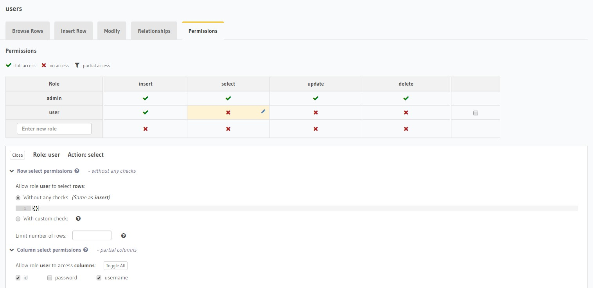
Select

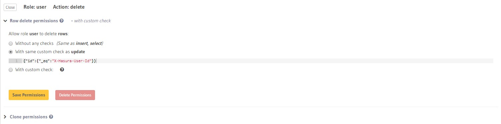
Delete

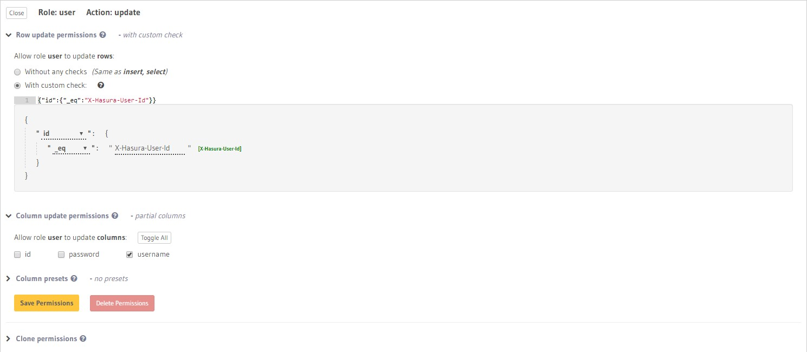
Update

The Update permissions can also be set by using this line of code

`{"id":{"_eq":"X-Hasura-User-Id"}}`

Go to permissions in `battles`

Set Insert, Update, Select, and Delete permissions

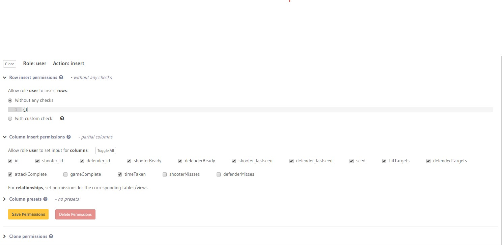
Insert

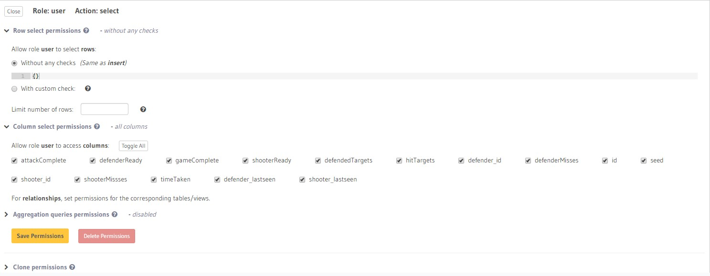
Select

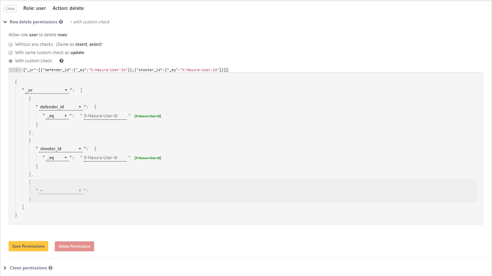
Delete

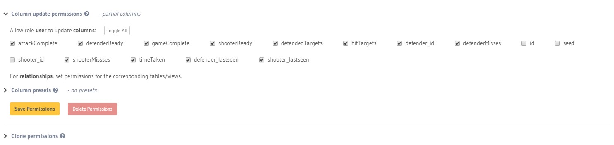
Update

The Update permissions can also be set by using this line of code

`{"_or":[{"_or":[{"shooter_id":{"_is_null":true}},{"shooter_id":{"_eq":"X-Hasura-User-Id"}}]},{"_or":[{"defender_id":{"_is_null":true}},{"defender_id":{"_eq":"X-Hasura-User-Id"}}]}]}`

Go to permissions in `old_battles`

Set Select and Delete permissions

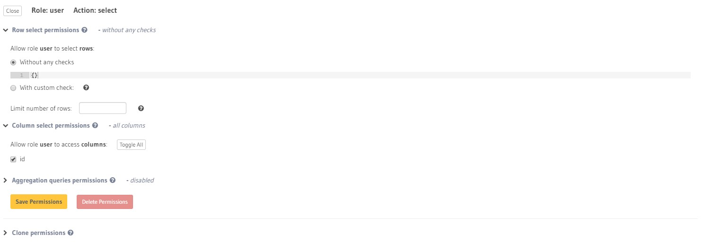
Select

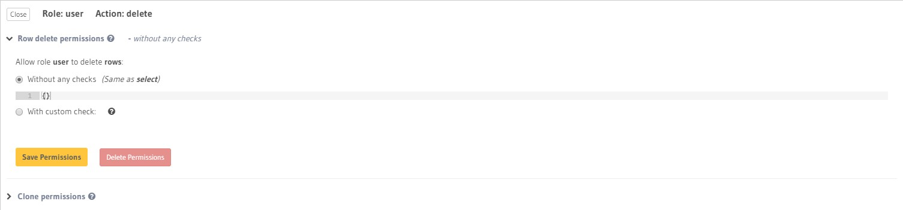
Delete

Go to  permissions in `online_battles`

Set Select permissions

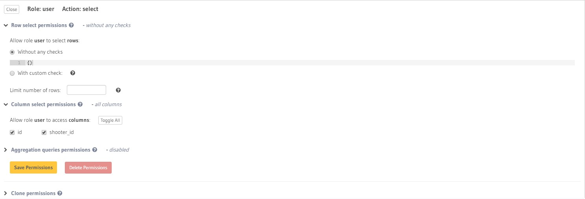
Select

And that's it. Those are the permissions set up for our Shooter Arena game. Next up, we set up our jwt service provider on glitch.

