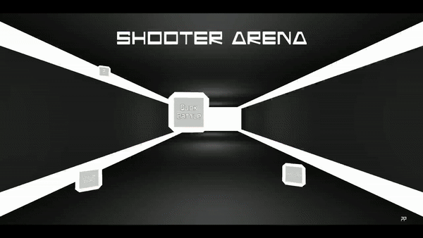

---
title: "Matchmaking"
metaTitle: "Matchmaking with Hasura and Unity | Hasura GraphQL Tutorial"
metaDescription: "This tutorial covers how to set up a matchmaking service with Hasura and Unity"
---

In this part of the course, we shall be implementing a matchmaking service into our Shooter game.
Matchmaking is the process of pairing players in games. For our Shooter game, we want to randomly pair online players together.

To achieve this we would:
- Create a Battle and User datamodel in our Hasura backend
- Use a GraphQL client for Unity to create queries, mutations and subscriptions to our Hasura backend
- Write functions to actually get and put data into our Battle datamodel model in our Hasura backend

At the end of this part of the course, players would be able to enter battle against fellow players from around the world.
